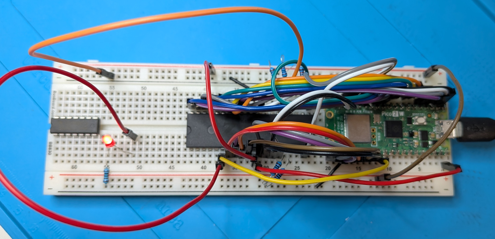
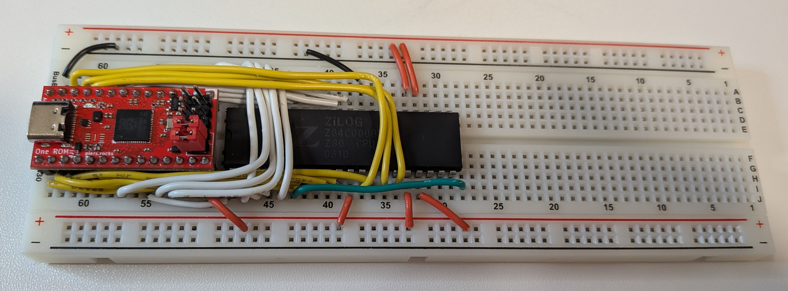

# Experimenting with using a Raspberry Pi Pico 2 W to emulate ROM, RAM and CLOCK

## Current Status:  Started to write a cli that runs via a serial terminal.  No commands yet, but a few control keys are defined as follows.

- ctrl-s   Toggle repeating display of the last mhz, addr, data values
- ctrl-f   Switchs from fast to slow cpu clock
- ctrl-z   Toggle display of keypress in hex, ie, left arrow is 1b5b44
- PageUp   Redirects keyboard io to the cpu io queue, NOT YET IMPLEMENTED
- PageDown Redirects keyboard io to the cli

A minimal cli line editor exists supporting the following keys.  Added a timeout in the ansi character loop to ensure it completes in case of an unrecognized ansi string or an ESC key not meant as a start of an ansi code.

- Enter       Sends cmd buffer to cmdLine for processing
- Backspace   Does what a backspace normall does
- Left Arrow  Move cursor left
- Right Arrow Moves cursor right
- Printable characters are send to screen

I am basically copying the cli I built in Javascript in my emu-sys-js project.  Although, I am already making improvements to the structure as each time I write this, I think of a better way of doing it.  Not complete or well tested yet.

### Speed 5.40 Mhz, restructured emulation loop, now has hooks for io requests that current do nothing, have added speed control by using the fast loop with a loop count of 1, so it only runs one time and then returns to loop1, where a delay can be used to slow it down.

### Issues with speed

I attempt to create a second emulation loop for when I wanted more control.  In that way, no if statements are required in the faster loop.  Doing this, the fast loop once again slowed down.  I believe the issue is related to cache size and adding this additional function, forced the code to be executed partially outside of cache.  I believe this is somewhat related to the gpio calls being in both functions.  So for now, I have this second slightly modified copy of the emulation loop mostly commented out.

In the process of my initial investigation of this issue, I discovered another additional way to up the speed, by using the __not_in_flash_func macro.  Speed now 4.88 Mhz.

Previous status: speed 2.67 Mhz, moved main loop into loop1 ( runs on second core ), removed more unnecessary code, all status is printed in loop ( runs on first core ), realized I had was still using the slower method of reading data lines.  After this change, I had to comment stop the interrupts as the loop hung.

A test of using a Pico to emulate ROM, RAM and CLOCK.  I decided to quickly try this myself before I receive my ONE-ROMs ( Fire 28 and Fire 40 ) by Piers Rocks, just received them but not tested.  One disadvantage of the using the stand Pi Pico is that not all the gpio pins are made available for use.  So even though the ONE ROM has the same pico chip, it is using more of the gpios available on this chip.  I am only using 11 address lines for this reason, whereas the ONE-ROM Fire 28 that I orders can handle 16 address lines I believe.  I was also limited as I am using a gpio as a clock instead of an external clock and at least one additional gpio as I am not using any external logic chips to reduce the number of gpios needed.  By also controlling the clock, it does make some aspects of doing this a little easier.  This is just meant to be a quick experiment, so not worried to get this to work with more memory.  Note:  Actually, the current full speed version does not have write protection, so it technically only emulates RAM.  It would be an easy change, but that would slow it down a bit.

I wanted to initially start with the commonly used digitalio arduino functions to get an idea of the speed.  After getting it working, the max speed was 0.123 mhz.

The next step was to use the gpio register functions to read/write multiple pins at once.  After gradually replacing these functions in the code, the speed gradually increased from 0.123 mhz to 1.170 mhz.  The code indicates the speed increase during various changes.

Some additional code changes and particularly placing a while loop inside the loop() function made a significant difference.

The setup is using a Raspberry Pi Pico 2 W connected to a Z80 cpu.  The pins are connected to the Z80 cpu as follows.

- Z80 address pins 0 - 10 --> gpio 0 - 10, allows for up to 2048k
- Z80 wr pin --> gpio 11
- Z80 rd pin --> gpio 12
- Z80 mreq pin --> gpio 13
- Z80 data pins --> gpio 14 - 21
- Z80 clock pin --> gpio 22

I uploaded the original python version of this.  Not much time was put into it, I basically got it working and wanted to try an Arduino version.  The python and the arduino versions were all done yesterday with a few minor changes today, so I haven't put any time into refining the code.

I am also going to be testing a z80 with the Fire 28 One Rom by Piers Rocks.  The breadboard wiring of the one rom to the z80 is complete, white wires 16 address lines, yellow wires 8 data lines, green wire clock line, red wires 5 volts, black wires grounds.  Note, 4 of the red wires are there to set the int, nmi, busrq and wait lines high.  Reset will also be set high with a resister as it needs to be pulled low at times.  Still need some logic for the mreq, rd and wr (if one rom is emulating a ram), to control the one rom ce pin and vpp pin if emulating ram.  This configuration is using one rom as a 27512 rom.  Not a very useful circuit as it has no peripherals at the moment.

